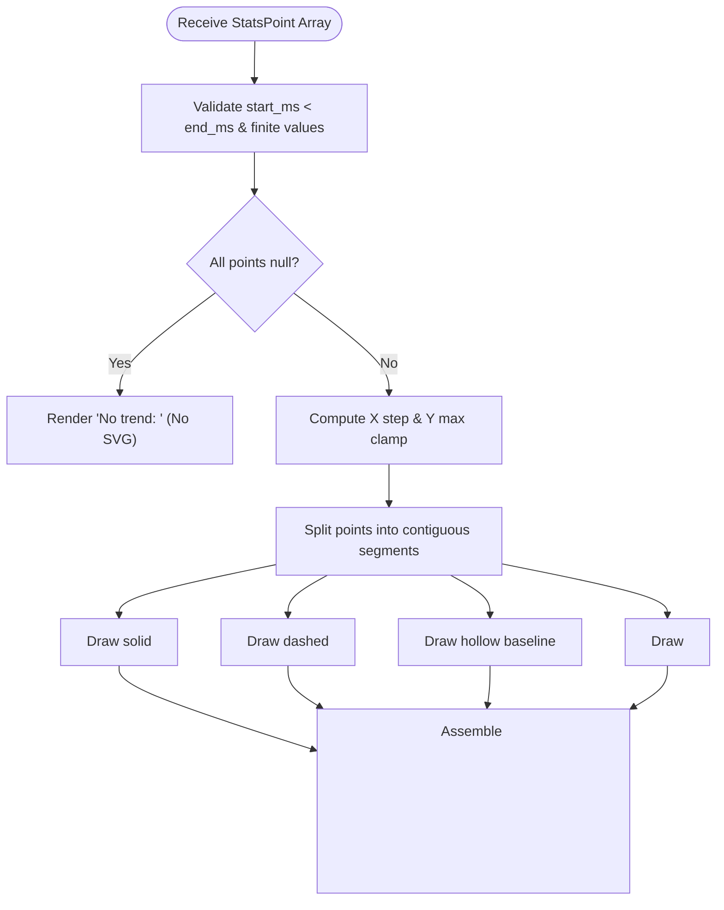

# C10.2 — The DORA Page: Design Review & Recommendations

**Review Date:** 2026-10-07  
**Target Spec:** [`2026-10-07-the-dora-page-design.md`](./2026-10-07-the-dora-page-design.md)  
**Status:** Review Complete · Actionable Improvements & Questions Identified

---

## 1. Executive Summary

The **C10.2 ("The DORA page")** design document provides a clean, well-grounded architecture for delivering team productivity and stability metrics within Nimbus Web Clipper.

### Key Strengths of the Design
1. **Honest Visualization Principle:** Adheres strictly to the core invariant that incomplete or unconfident data must never masquerade as healthy zeros or interpolated slopes. Breaking trendlines on `null` and naming distinct gaps per metric row directly prevents misinterpretation.
2. **True Time Series via `/v1/metrics/stats`:** Leveraging gateway v7.19.0's bucketed time series route resolves the fundamental limitation of nested-window comparisons from the original §5.
3. **Loopback & Zero New Permissions:** Utilizes the unauthenticated public read-only table on `127.0.0.1`, requiring no token scopes, no manifest modifications, and no permission prompts.
4. **Resilient Degradation & Capability Probing:** Gracefully handles older gateways (404 on `/metrics/stats` drops sparklines cleanly while preserving DORA headlines) without imposing rigid version gates.
5. **Decoupled Architecture:** Follows the pure view / controller separation established in `src/ledger/` and `src/brief/`, keeping `dora-view.ts` 100% testable in JSDOM without network mocks.

---

## 2. Open Questions & Ambiguities

### Q1: Identifier Mapping Between Headline DORA Metrics and Stats Series
* **Context (§3, §4.1):** 
  * In `DoraMetricsResult.metrics` (`GET /v1/metrics/dora`), the four keys are snake_case: `deployment_frequency`, `lead_time_for_changes`, `change_failure_rate`, `mttr`.
  * In `StatsMetricId` (`GET /v1/metrics/stats?metric=`), the identifiers are kebab-case: `"deployment-frequency"`, `"lead-time"`, `"change-failure-rate"`, `"mttr"`, plus activity metrics `"pr-merges"`, `"incidents-opened"`.
* **The Ambiguity:** Note the difference between `lead_time_for_changes` (headline) and `lead-time` (stats), as well as the naming case difference.
* **Recommendation:** Define an explicit mapping constant in `src/shared/dora.ts` to prevent runtime mismatches:
  ```ts
  export const DORA_DELIVERY_METRIC_MAP = {
    deployment_frequency: "deployment-frequency",
    lead_time_for_changes: "lead-time",
    change_failure_rate: "change-failure-rate",
    mttr: "mttr",
  } as const;
  ```

---

### Q2: Sparkline Math on Flat & Zero-Value Series
* **Context (§5.3):** The spec specifies:
  > *"The y-axis starts at zero and ends at the largest plotted value."*
* **The Edge Case:** If all non-null points in a window have a value of `0` (e.g., 0 incidents opened across all weeks, or 0% failure rate):
  * `max_value = 0`.
  * Normalizing point height via `(value - min) / (max - min)` or `value / max` will yield `0 / 0 = NaN`.
  * If unhandled, this results in invalid SVG paths (`d="M 0 NaN L 10 NaN"`), causing browser console errors and broken rendering.
* **Recommendation:** Explicitly specify the scale fallback in `dora-view.ts`:
  ```ts
  const maxY = Math.max(...validPoints.map(p => p.value), 1); // Clamp denominator to >= 1
  ```
  Additionally, for single-point series (e.g., where only 1 bucket has a non-null value), specify that a standalone marker circle is drawn since a 1-point path has no line segment.

---

### Q3: Formatting & Unit Specifications Across Granularities
* **Context (§5.2):** Units format via a `Record` over known units (`deploys_per_day`, `seconds_median`, `ratio`, `merges`, `incidents`).
* **Open Details:**
  1. **Ratio/Percentages:** Should `ratio` (e.g., `0.042`) format to 1 decimal place (`4.2%`) or round to an integer (`4%`)? What about `0%`?
  2. **Durations (`seconds_median`):** How should durations span across seconds, minutes, hours, and days? For example:
     * `< 60s` &rarr; `"45s"`
     * `< 3600s` &rarr; `"18m"`
     * `< 86400s` &rarr; `"4.2h"` or `"4h 12m"`?
     * `> 86400s` &rarr; `"2.5d"` or `"2d 12h"`?
  3. **Trend Tooltip / Point Hover Values:** When hovering over sparkline points, does the tooltip show raw units or formatted strings?
* **Recommendation:** Standardize the duration formatter function in `src/shared/dora.ts` (reusable between MTTR and Lead Time) and document exact decimal precisions (e.g., ratios to 1 decimal place `0.0%`, deploy frequencies to 1 decimal place `0.0 / day`).

---

### Q4: Service Picker Preselection, Auto-Select & URL Synchronization
* **Context (§4.2):** `?service=<id>` preselects a service; an absent or unbound ID opens the picker without erroring.
* **Questions:**
  1. **Single Binding Behavior:** If the user has exactly **one** bound service and opens `dora.html` with no `?service=` parameter, should the page automatically select and load that service? (Recommended: Yes, auto-select if `bindings.length === 1`).
  2. **URL State Reflection:** When the user changes the selected service in the `<select>` dropdown, should the page update the browser URL bar via `window.history.replaceState`? (Recommended: Yes, updating `?service=<newId>` ensures browser refresh and tab duplication retain the active service).
  3. **Unbound Service Parameter:** If `?service=unbound-svc` is passed in the URL but not present in `service-bindings-list`, should the picker display an informational banner suggesting how to bind it?

---

### Q5: Progressive Settlement vs. Batch Render
* **Context (§4.4):**
  > *"A render issues one `dora-metrics` and six `metrics-stats` messages concurrently under `Promise.allSettled` — never `Promise.all`. Each row fills as its read settles and fails on its own."*
* **The Ambiguity:**
  * If `Promise.allSettled([req0, req1, ...req6])` is used with a single `await`, the UI will wait until the slowest of all 7 requests completes before rendering any row.
  * If rows fill progressively as each read settles, each promise must attach its own `.then(...)` handler that checks the generation counter and renders its specific row immediately.
* **Recommendation:** Clarify the async execution model in §4.4:
  ```ts
  // Each request attaches an immediate completion handler to update its DOM row:
  fetchDoraRow(...).then(res => {
    if (currentGen !== generation) return;
    renderHeadline(res);
  });
  // Promise.allSettled is awaited at the page level solely to detect all-unreachable:
  const outcomes = await Promise.allSettled(allSevenRequests);
  if (currentGen === generation && allUnreachable(outcomes)) {
    renderAllUnreachableState();
  }
  ```

---

### Q6: `open-dora` Message Handshake & Response Payload
* **Context (§6.1, §7.2):**
  * The panel deploy section sends `open-dora { serviceId }`.
  * The background worker receives it, validates `serviceId` with `sendableId`, and calls `chrome.tabs.create`.
* **The Ambiguity:** In §6.1, the spec says:
  > *"`open-dora { serviceId }` → no payload (§7.2)"*
* **Question:** What is the exact typed response for `open-dora` crossing `chrome.runtime.sendMessage`? In MV3 message listeners, responding with `{ ok: true }` or `{ ok: false }` is required so callers awaiting the promise don't hang or receive `undefined`.
* **Recommendation:** Formally type `OpenDoraRequest` and `OpenDoraResponse` in `src/shared/messages.ts`:
  ```ts
  export interface OpenDoraRequest {
    readonly kind: "open-dora";
    readonly serviceId: string;
  }
  export type OpenDoraResponse = { readonly kind: "open-dora"; readonly ok: true };
  ```

---

## 3. Architecture & Implementation Improvements

### Improvement 1: Detailed SVG Sparkline Path Generation

To ensure robust implementation of §5.3 (breaking lines on null, dashed lines on gapped values, hollow markers), we recommend following this SVG path decomposition:



#### Recommended SVG Structure:
```html
<svg class="nimbus-sparkline" viewBox="0 0 160 32" role="img" aria-label="13 weekly points, 9 with values, 0.8–1.7 / day">
  <!-- Baseline reference line -->
  <line class="nimbus-sparkline__baseline" x1="0" y1="28" x2="160" y2="28" />
  
  <!-- Continuous segment without gaps -->
  <path class="nimbus-sparkline__line" d="M 0 20 L 26 14 L 53 18" />
  
  <!-- Discontinuous gap / hollow baseline marker -->
  <circle class="nimbus-sparkline__marker--null" cx="80" cy="28" r="3">
    <title>Week of Sep 14: Too few events to report a value</title>
  </circle>
  
  <!-- Resumed segment with dashed line for gapped value -->
  <path class="nimbus-sparkline__line nimbus-sparkline__line--gapped" stroke-dasharray="2 2" d="M 106 12 L 133 8" />
  <circle class="nimbus-sparkline__marker--gapped" cx="106" cy="12" r="3">
    <title>Week of Sep 21: 1.2 / day (mixed_source)</title>
  </circle>
</svg>
```

---

### Improvement 2: Range Definition Table & Parameter Helper

Centralize the range configuration and validation in `src/shared/dora.ts` to guarantee that the UI range toggle and background request builder share identical arithmetic:

```ts
export const DORA_RANGES = ["4w", "13w", "26w"] as const;
export type DoraRangeId = (typeof DORA_RANGES)[number];

export interface DoraRangeDef {
  readonly id: DoraRangeId;
  readonly label: string;
  readonly sinceParam: string;      // e.g. "28d", "91d", "182d"
  readonly windowMs: number;        // e.g. 28 * 86400000
  readonly bucketMs: number;        // e.g. 2 * 86400000
  readonly expectedPoints: number;  // 14 or 13
}

export const RANGES: Record<DoraRangeId, DoraRangeDef> = {
  "4w": {
    id: "4w",
    label: "4 weeks",
    sinceParam: "28d",
    windowMs: 28 * 86_400_000,
    bucketMs: 2 * 86_400_000,
    expectedPoints: 14,
  },
  "13w": {
    id: "13w",
    label: "13 weeks",
    sinceParam: "91d",
    windowMs: 91 * 86_400_000,
    bucketMs: 7 * 86_400_000,
    expectedPoints: 13,
  },
  "26w": {
    id: "26w",
    label: "26 weeks",
    sinceParam: "182d",
    windowMs: 182 * 86_400_000,
    bucketMs: 14 * 86_400_000,
    expectedPoints: 13,
  },
};

export const DEFAULT_DORA_RANGE: DoraRangeId = "13w";

export function isDoraRangeId(v: unknown): v is DoraRangeId {
  return typeof v === "string" && (DORA_RANGES as readonly string[]).includes(v);
}
```

---

### Improvement 3: Wire Types and Pure Parsers (`src/shared/dora.ts`)

To uphold the project invariant against object pass-through and shape drift, `parseDoraMetrics` and `parseStatsSeries` should reconstruct clean objects and reject shape irregularities:

```ts
export const MAX_BUCKETS = 400;

export const DORA_GAPS = [
  "unknown_service",
  "no_pagerduty_mapping",
  "no_repos",
  "no_deployment_data",
  "low_sample",
  "approximate_lead_time",
  "mixed_source",
] as const;

export const STATS_GAPS = [
  ...DORA_GAPS,
  "github_only_merge_data",
  "incidents_missing_opened_at",
] as const;

export type DoraGap = (typeof DORA_GAPS)[number] | typeof UNRECOGNISED_GAP | null;
export type StatsGap = (typeof STATS_GAPS)[number] | typeof UNRECOGNISED_GAP | null;

export function parseStatsGap(v: unknown): StatsGap | undefined {
  if (v === null) return null;
  if (typeof v !== "string") return undefined;
  return (STATS_GAPS as readonly string[]).includes(v) ? (v as StatsGap) : UNRECOGNISED_GAP;
}
```

---

### Improvement 4: Router Cognitive Complexity Budget

In `src/background/service-worker.ts`, message routing is strictly constrained by SonarCloud rule **S3776** (cognitive complexity threshold of 15).

* Currently, the router is divided into five slices: `routeCapturePair`, `routeIndexReads`, `routeQueueAndConnection`, `routeDeploy`, and `routeSubRouters`.
* `routeDeploy` currently handles 5 messages (`deploy-preflight`, `service-bind`, `service-unbind`, `service-bindings-list`, `service-bindings-check`).
* Adding `dora-metrics`, `metrics-stats`, and `open-dora` directly into `routeDeploy` will add 3 branches, potentially risking complexity overflow.

**Recommendation:**  
Add a dedicated sub-router slice `routeDora(message, respond): Routed` or keep `routeDeploy` cleanly partitioned:
```ts
function routeDora(message: unknown, respond: Respond): Routed {
  if (isDoraMetricsRequest(message)) {
    handleDoraMetrics(deployDeps, message).then(respond).catch(() => {
      respond({ kind: "dora-metrics", ok: false, reason: "server_error" });
    });
    return true;
  }
  if (isMetricsStatsRequest(message)) {
    handleMetricsStats(deployDeps, message).then(respond).catch(() => {
      respond({ kind: "metrics-stats", ok: false, reason: "server_error" });
    });
    return true;
  }
  if (isOpenDoraRequest(message)) {
    handleOpenDora(message);
    respond({ kind: "open-dora", ok: true });
    return true;
  }
  return null;
}
```

---

### Improvement 5: Panel & Options Page UX Details

1. **Panel Link Placement:**
   * In `src/panel/deploy/deploy-view.ts`, when a service is bound and the deploy readiness verdict renders, add a secondary footer link:
     ```html
     <div class="nimbus-deploy__footer">
       <button type="button" class="nimbus-deploy__dora-link" data-service="payments-api">
         Delivery metrics for payments-api →
       </button>
     </div>
     ```
   * Clicking it dispatches `open-dora` with `{ serviceId }`.
2. **Options Page Navigation:**
   * In `src/options/options.html`, add a `"DORA metrics"` button alongside Briefs and Activity.
   * In `src/options/options.ts`, wire `document.getElementById("open-dora")?.addEventListener("click", () => openExtensionPage("dora.html"))`.

---

## 4. Test Coverage Checklist

To align with the testing requirements in §8 and maintain the strict coverage gate:

- [ ] **`test/unit/dora.test.ts`**:
  - [ ] `parseDoraMetrics`: Rejects mismatched service, non-finite numbers, malformed gap types; parses unknown gaps as `UNRECOGNISED_GAP`.
  - [ ] `parseStatsSeries`: Rejects points > 400, `start_ms >= end_ms`, mismatched metric IDs.
  - [ ] `RANGES`: Asserts all 3 ranges divide evenly without remainder, points $\le 400$, and `sinceParam` matches `^\d+d$` within 1–365.
- [ ] **`test/unit/messages.test.ts`**:
  - [ ] `isDoraMetricsRequest` & `isMetricsStatsRequest`: Reject strings outside `DORA_RANGES` and `STATS_METRIC_IDS`.
  - [ ] `isOpenDoraRequest`: Validates `serviceId` via `sendableId`.
- [ ] **`test/unit/deploy-client.test.ts`**:
  - [ ] `fetchDoraMetrics`: Returns `DeployResult<DoraMetricsResult>`, validates query string parameters.
  - [ ] `fetchStatsSeries`: Validates status ladder (200 &rarr; `ok`, 404 &rarr; `unsupported`, 400 &rarr; `refused`, timeout/network &rarr; `unreachable`, non-2xx &rarr; `server_error`, bad body &rarr; `malformed`).
- [ ] **`test/unit/dora-view.test.ts` (JSDOM)**:
  - [ ] Exhaustive `Record` testing for `GAP_NOTE` and unit formatting.
  - [ ] Null values render `"—"` and never `"0"`.
  - [ ] Sparkline SVG generates valid inline elements, broken segments on null, dashed segments on gapped values, and correct `aria-label`.
  - [ ] All-null sparkline series renders `"No trend: <reason>"` without SVG.
  - [ ] Flat series (all 0 values) avoids division-by-zero / `NaN`.
- [ ] **`test/unit/dora-page.test.ts` (JSDOM)**:
  - [ ] Discards stale responses when generation counter increments.
  - [ ] 404 on stats displays page-level banner while keeping headlines intact.
  - [ ] All 7 unreachable displays `"Can't reach your Nimbus gateway"`.
  - [ ] Service picker switches service and updates range preferences.
  - [ ] `localStorage` throwing does not crash page load.
- [ ] **`test/unit/build-artifacts.test.ts`**:
  - [ ] Validates `dora.js`, `dora.html`, and `dora.css` in `ENTRIES`, `HTML_CSS`, and `REQUIRED_FILES`.
- [ ] **`test/e2e/dora.e2e.ts`**:
  - [ ] `dora-from-options`: Navigation from Options page.
  - [ ] `dora-from-panel`: Navigation from Panel deploy section.
  - [ ] `dora-old-gateway`: Verification of 404 fallback on older gateway fixture.

---

## 5. Summary & Recommendation

The specification [`2026-10-07-the-dora-page-design.md`](./2026-10-07-the-dora-page-design.md) is structurally sound, adheres to all project security and honesty invariants, and properly designs the C10.2 deliverable.

Addressing the open questions and incorporating the edge-case protections detailed above (especially the sparkline division-by-zero safeguard, metric ID mapping, and explicit message response shapes) will ensure a seamless, defect-free implementation.
